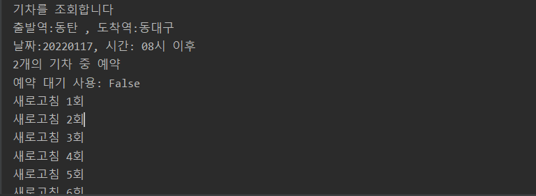

# Python program for booking SRT ticket.


매진된 SRT 표의 예매를 도와주는 파이썬 프로그램입니다.  
원하는 표가 나올 때 까지 새로고침하여 예약을 시도합니다.


## 다운
```cmd
git clone https://github.com/Rahk92/SRT_reservation.git
```
  
## 필요
- Google Chrome Browser (Chromedriver 자동 설치)
- 파이썬 3.10에서 동작 확인

```py
pip install -r requirements.txt
```

## Arguments
    dpt: SRT 출발역
    arr: SRT 도착역
    dt: 출발 날짜 YYYYMMDD 형태 ex) 20220115
    tm: 출발 시간 hh 형태, ex) 06, 07, 08 ...
    num: 검색 결과 중 예약 가능 여부 확인할 기차의 수 (default : 2)
    quantity: 예매 표 개수 (default : 1)

    token: 텔레그램 예약 알림을 위한 Bot Token
    chat_id: 텔레그램 예약 알림을 위한 Chat ID
    
    reserve: 예약 대기가 가능할 경우 선택 여부 (default : False)
    special: 특실 예약 여부 (default : False)
    any: 일반식, 특실 상관없이 무조건 예약 여부 (default : False)

    station_list = ["수서", "동탄", "평택지제", "천안아산", "오송", "대전", "김천(구미)", "동대구",
    "신경주", "울산(통도사)", "부산", "공주", "익산", "정읍", "광주송정", "나주", "목포"]


## 간단 사용법

회원번호 1234567890  
비밀번호 000000  
동탄 -> 동대구, 2022년 01월 17일 오전 8시 이후 기차  
검색 결과 중 상위 2개가 예약 가능할 경우 예약

```cmd
python quickstart.py --user 1234567890 --psw 000000 --dpt 동탄 --arr 동대구 --dt 20220117 --tm 08
```

**에약대기**  
예약대기 사용 및 검색 결과 상위 3개의 예약 가능 여부 확인
```cmd
python quickstart.py --user 1234567890 --psw 000000 --dpt 동탄 --arr 동대구 --dt 20220117 --tm 08 --num 3 --reserve True
```

**여러 표 예약**  
특실 예약 사용 및 검색 결과 상위 3개의 예약 가능 여부 확인 그리고 예매 최대 개수 2개 설정
```cmd
python quickstart.py --user 1234567890 --psw 000000 --dpt 동탄 --arr 동대구 --dt 20220117 --tm 08 --num 3 --quantity 2 --special True
```

**텔레그램 알림**  
무조건 예약 사용 및 검색 결과 상위 3개의 예약 가능 여부 확인 그리고 텔레그램 알림 설정
```cmd
python quickstart.py --user 1234567890 --psw 000000 --dpt 동탄 --arr 동대구 --dt 20220117 --tm 08 --num 3 --quantity 2 --special True --token qwerasdf::15883300 --chat_id 987654321
```

**실행 결과**



## Telegram 봇 사용법

텔레그램 Bot Token, Chat ID 확인법 : https://jojoldu.tistory.com/659


## 기타  
원래 코드 : https://github.com/kminito/srt_reservation
